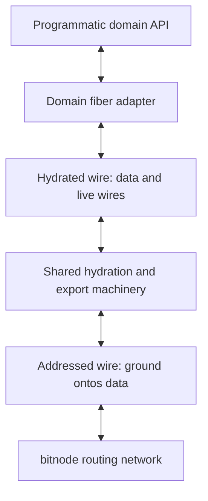
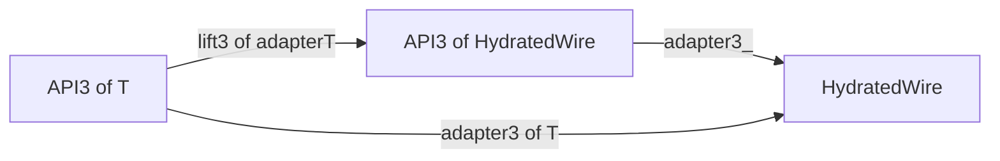

# Hydrated wire proposal

**Status: proposal, 7 October 2026.** This proposes a shared messaging layer in
which messages can contain live wires. bitwire would define its value domain,
interfaces, ground representation and behavioral laws; bitruntime would implement
hydration, export registries and proxies; bitnode would assemble those mechanisms
within its routing network. Domain adapters would use the hydrated interface.

The current releases, bitwire 0.5.0 and bitruntime 0.6.0, provide the ground-value
substrate. The interfaces and encoding below are proposed additions, not released
APIs or a completed transport protocol. The reference and lifetime choices in
[Protocol decisions](#protocol-decisions) must be settled before implementation;
[decision 0019](../decisions/0019-hydrated-wire-protocol.md), accepted 7 October
2026, decides them for a first edition within one namespace.

## Purpose

A fiber relates the representations and access views of a domain, together with
their adapters. Its wire adapter should express domain operations, arguments,
results and failures as messages. It should be able to place a live reply wire,
subscription sink or another service wire inside a message without assigning
reference IDs, managing export tables or implementing forwarding.

The shared layer converts those live capabilities into ground references for
transport and reconstructs usable proxies at the destination. A received proxy
accepts the same hydrated value domain, so messages sent through it can contain
further wires. The abstraction is recursively usable in both directions.

An export table alone does not supply this interface. A complete realization
must also traverse values, preserve ordinary data, import references, forward
sends, account for resources and release the associated state.

## Layers and ownership



The destination applies the same layers in reverse. A local pair or direct
network connection can supply the lower boundary without a bitnode executable.
Domain adapters depend on the hydrated interface independently of that placement.

| Owner | Responsibility |
| --- | --- |
| bitwire | Hydrated values and interaction interfaces; ground representation and reference/control protocol; ownership, admission and lifetime laws; pure format codecs and independent conformance cases. |
| bitruntime | Stateful dehydration and hydration; export and import registries; proxy construction and forwarding; receive dispatch, bounds and cleanup; reusable routing mechanisms. |
| bitnode | Network topology, membership, route admission, outlet placement and configuration of runtime mechanisms within its chosen namespace. |
| Domain adapter | Operation names, argument and result meanings, failure projection and the service's exchange conventions. |
| ontos | Ground atoms, tuples and their canonical bytes. Live capability semantics remain above this domain. |

This refines the existing [composition ownership](composition.md#owners-and-dependencies)
and [wire export direction](composition.md#exporting-an-existing-wire).
The foundational definitions stay independent of bitruntime, bitnode and any
particular domain implementation.

Ordinary transit routing forwards ground payloads without hydrating application
contents. A runtime that terminates an export or re-exports an imported wire acts
at the reference boundary; it may need to interpret and transform references.
That role is distinct from forwarding a packet to its addressed destination.

## Hydrated values

The proposed domain is:

```text
HydratedValue = Atom(Bytes)
              | HydratedTuple(HydratedValue*)
              | HydratedWire
```

Atom bytes and tuple arity, order and multiplicity retain their ontos meanings.
The tuple structure is finite, immutable and well-founded. Wires are opaque live
leaves: they can participate in cyclic communication relationships without making
the tuple structure cyclic. Traversal and reconstruction never invoke a leaf's
send operation.

Ground values embed structurally into hydrated values. Ordinary ontos Tuple
instances can serve as tuples containing only ground values; the hydrated tuple
constructor also admits wire leaves. Its construction and validation must
capture the supplied structure before asynchronous admission. Wire leaves retain
their capability identity rather than being copied as application objects.

Ground structural equality still applies to ground values. No equality operation
for live capabilities, imported proxies or whole hydrated values containing them
is implied. Repeated references to the same export must preserve its target and
authority, but imports need not have the same language-level object identity.

## Proposed TypeScript surface

These declarations use bitwire's existing Atom and Termination types. The names
are proposed; a release must provide corresponding declarations and observations
across the supported language presentations.

```typescript
export type HydratedValue = Atom | HydratedTuple | HydratedWire;

export interface HydratedTuple {
  readonly kind: "tuple";
  readonly length: number;
  items(): readonly HydratedValue[];
  at(index: number): HydratedValue | undefined;
}

export declare function hydratedTuple(
  items: readonly HydratedValue[],
): HydratedTuple;

export interface HydratedWire {
  send(message: HydratedValue): Promise<void>;
}

export interface HydratedEndpoint extends HydratedWire {
  receive(
    handler: (message: HydratedValue, context: ReceivedContext) => void,
  ): () => void;
  readonly closed: Promise<Termination>;
  close(): Promise<void>;
}
```

`ReceivedContext` is what the composition establishes about an arrival, such
as a checked origin; it is never part of the message
([decision 0019, D4](../decisions/0019-hydrated-wire-protocol.md#d4-addressed-binding-and-received-context)).

HydratedWire grants sending authority. HydratedEndpoint additionally owns one
receive attachment and the lifetime of its declared communication scope. Passing
an endpoint as a wire conveys only the send capability. It does not transfer its
receive attachment or permission to close that endpoint.

The existing ground Wire, Endpoint and AddressedWire remain the substrate.
HydratedWire adds a distinct value domain above them; it does not change what a
ground carrier accepts. Domain adapters do not need an addressed hydrated
interface to send through a held capability. Runtime composition establishes the
addressed bindings beneath it.

A ground-only Wire does not automatically become a HydratedWire: it cannot
receive a message containing live capabilities. Runtime construction and value
recognition must enforce that distinction even where a language's structural
typing is permissive. A proposed adapter between those boundaries must define
the messages it accepts rather than relying on a type cast.

## Example domain exchange

Suppose a domain adapter holds a service wire, a reply wire and two domain values.
Its request can be expressed schematically as:

```typescript
await serviceWire.send(
  hydratedTuple([operation, argumentsValue, replyWire]),
);
```

The runtime exports replyWire and sends its reference alongside the encoded
operation and arguments. The remote runtime reconstructs a proxy. After domain
validation, the provider sends its result through that proxy. A result may itself
contain a wire, and a later message through that wire uses the same mechanism.

Neither domain adapter exports or imports references explicitly. The service
still defines its request shape, number of permitted replies, success and failure
messages, and completion behavior. Hydration alone does not supply a universal
request/response protocol, cancellation semantics or exactly-once execution.

## Composing domain adapters

The proposed compositional property is that adapting a parameterized domain API
commutes with adapting its parameter and then applying a reusable outer adapter.
This requires a defined lifting for that API and adapters that preserve its
observable behavior. A generic type parameter alone does not establish the law.

### Lifting a parameterized API

Write `W` for `HydratedWire`. Starting with independent domain adapters and one
outer adapter specialized to wires:

```text
adapter1  : API1 -> W
adapter2  : API2 -> W
adapter3_ : API3<W> -> W
```

For a parameter adapter `adapterT`, the missing operation is:

```text
lift3(adapterT) : API3<T> -> API3<W>

adapter3<T>(api) = adapter3_(lift3(adapterT)(api))
```

`adapterT` applies to a `T`, while `api` is an `API3<T>`. `lift3` applies the parameter
adaptation at the places where `API3` produces or accepts `T`, including future
method calls and nested callback positions. It is an API view over the original
service, rather than a snapshot of the values present at construction.



Both routes should yield the same declared observations. The same `adapter3_` can
therefore serve `API3<API1>` and `API3<API2>`; it does not need to understand either
inner domain. The fiber owning `API3` defines its lifting and outer message
convention. The common hydration machinery transports the resulting wire leaves.

### Directions required by the parameter

The following table concerns constructing `API3<W>` over an existing `API3<T>`:

| How API3 uses T | Conversion required at that boundary |
| --- | --- |
| Produces T | `T -> W`: convert each returned T into a wire. |
| Accepts T | `W -> T`: reconstruct T before passing the argument to the original service. |
| Both produces and accepts T | Both directions. |

For an output-only API, a one-way adapter can suffice for this lifting. An
input-only API uses precomposition in the reverse direction. Mixed use, as in
Cell below, needs an adapter pair. Nested methods and callbacks follow the same
direction analysis; a callback parameter cannot be classified just by its outer
argument position.

For the two-way examples, use this domain adapter contract:

```typescript
interface Adapter<T> {
  toWire(value: T): HydratedWire;
  fromWire(wire: HydratedWire): T;
}
```

`fromWire` constructs a programmatic view, typically a proxy. Its argument must
speak the domain's declared wire convention; a generic `HydratedWire` type alone
does not certify that. Protocol validation and failure remain required. These
examples assume an explicitly supplied communication scope is already captured
by the adapter; they do not introduce an implicit global registry or lifetime.

The captured environment must also identify who owns each materialized local
wire and when its service lifetime ends. If the chosen profile requires an
owned endpoint, `toWire` returns that endpoint's sending face and its owner
retains the close responsibility. Receiving the face grants no close authority.
The domain convention determines the service's end event; shared runtime
machinery performs the resulting reference cleanup. Repeated `toWire` calls
must not silently create unbounded retained endpoints. The signatures below
omit this ownership plumbing, so the equations alone are not a complete
resource-lifetime design.

### Cell example

Cell both returns and accepts its parameter. Its lifting converts on each call:

```typescript
interface Cell<T> {
  get(): Promise<T>;
  set(value: T): Promise<void>;
}

function liftCell<T>(
  cell: Cell<T>,
  adapter: Adapter<T>,
): Cell<HydratedWire> {
  return {
    get: async () => adapter.toWire(await cell.get()),
    set: async wire => cell.set(adapter.fromWire(wire)),
  };
}
```

`get` adapts the value produced by that particular read. `set` receives a wire,
reconstructs its T view and passes that to the original cell. Constructing the
lifted cell calls neither get nor set. It adds no cache, eager read or duplicate
provider invocation. The domain adapter must preserve the cell's declared
failures and asynchronous completion behavior as well as its successful values.

The reverse lifting produces a typed view over a cell of wires:

```typescript
function lowerCell<T>(
  cell: Cell<HydratedWire>,
  adapter: Adapter<T>,
): Cell<T> {
  return {
    get: async () => adapter.fromWire(await cell.get()),
    set: async value => cell.set(adapter.toWire(value)),
  };
}

function cellAdapter<T>(
  wireCellAdapter: Adapter<Cell<HydratedWire>>,
  innerAdapter: Adapter<T>,
): Adapter<Cell<T>> {
  return {
    toWire: cell =>
      wireCellAdapter.toWire(liftCell(cell, innerAdapter)),
    fromWire: wire =>
      lowerCell(wireCellAdapter.fromWire(wire), innerAdapter),
  };
}
```

`wireCellAdapter` is written once for `Cell<HydratedWire>`. With independent
adapters for `API1` and `API2`, the compositions are:

```typescript
// API1 and API2 are the independently defined domain interfaces.
declare const api1Adapter: Adapter<API1>;
declare const api2Adapter: Adapter<API2>;
declare const wireCellAdapter: Adapter<Cell<HydratedWire>>;

const api1CellAdapter = cellAdapter(wireCellAdapter, api1Adapter);
// Adapter<Cell<API1>>

const api2CellAdapter = cellAdapter(wireCellAdapter, api2Adapter);
// Adapter<Cell<API2>>

const nestedCellAdapter = cellAdapter(wireCellAdapter, api1CellAdapter);
// Adapter<Cell<Cell<API1>>>
```

The outer protocol remains the Cell protocol at every nesting depth. Each inner
adapter contributes its own domain interpretation, and the runtime transports
the resulting wire capabilities recursively. Replacing API1 with API2 requires
no Cell protocol branch or additional reference encoding.

### Commuting and coherence laws

The proposed commuting requirement is:

```text
adapter3<T> ≈ adapter3_ composed with lift3(adapterT)
```

If `adapter3<T>` is defined by that composition, the equation describes its
construction. The substantive obligation is that this construction preserves
`API3<T>`'s domain contract; any independently written direct adapter for the same
convention must have equivalent observations. A shared function signature is
insufficient evidence.

Here ≈ means observational equivalence at a declared boundary. Compare
corresponding initial state, capability aliases, authority, lifetimes, schedules
and transport conditions. Observations include operation arguments, results,
effects, invocation counts, failures, ordering and completion. Allocation IDs,
proxy object identity and byte-for-byte protocol traces need not match unless
the convention explicitly makes them observable. Network failure or extra
forwarding cannot be ignored to claim equivalence to unrestricted local calls.

For a two-way adapter, require the appropriate round-trip laws on valid values
and wires speaking its domain convention:

```text
fromWire(toWire(value)) ≈ value
toWire(fromWire(wire))  ≈ wire
```

These compare service behavior, not object identity. They do not claim that
every arbitrary wire can be decoded as every domain type, or that the round trip
grants authority to receive from or close an original endpoint.

Liftings should also respect identity and composition. For bidirectional
adaptations `r` between A and B and `s` between B and C, `liftF(r)` is the corresponding
pair between `F<A>` and `F<B>`. Define:

```text
(s composed with r).forward  = s.forward composed with r.forward
(s composed with r).backward = r.backward composed with s.backward

liftF(identity)          ≈ identity
liftF(s composed with r) ≈ liftF(s) composed with liftF(r)
```

For output-only APIs these can be ordinary forward maps. Input-only APIs reverse
the mapping direction. For mixed APIs, the displayed equations use coherent
adapter pairs with the required round-trip properties; they are not a claim that
Cell is covariant in arbitrary one-way functions. They express why introducing
an intermediate representation or grouping nested adaptations differently should
preserve the declared behavior.

An API that relies on local object identity, inspects a concrete implementation
or transfers ownership needs additional mapping rules before this property can
be claimed. Recursive hydrated wires make the composition representable; the
domain's lifting laws and the runtime's transport laws establish its meaning.

## Ground encoding

The protocol must distinguish a wire reference from any ordinary data that
resembles one. A candidate is to tag every encoded node, rather than interpreting
particular application tuples heuristically:

| Hydrated node | Candidate ground representation |
| --- | --- |
| Atom a | Tuple(atomTag, a) |
| Tuple of children | Tuple(tupleTag, Tuple(each encoded child)) |
| Wire w | Tuple(wireTag, encodedReferenceFor(w)) |

All tags and references in this representation are ground ontos values. The
three tags are atoms with distinct exact byte spellings. An ordinary tuple resembling the
third row is encoded through the second row, so decoding restores it as ordinary
data. The parser recognizes references only within an explicitly selected
hydrated protocol, never by scanning arbitrary raw messages.

The final protocol must fix tag bytes, arities, version discrimination, reference
grammar and malformed-input behavior, then provide independent canonical vectors.
These symbolic rows are an encoding candidate, not those final bytes. A path in
a reference or an ordinary application value retains its exact byte segments;
neither carrier decoding nor hydration implicitly rebases arbitrary payload data.

The encoding produces an ordinary Value for the existing addressed layer and
ontos-codec-v1 carrier. ontos's ground domain and the WebSocket carrier format
need no extension. The complete encoded representation, including reference and
control overhead, counts toward the declared message and queue limits.

Pure codecs in bitwire validate and construct the ground protocol representation.
Stateful traversal that registers exports or creates imported proxies belongs in
bitruntime. A pure codec must not allocate live routes, acquire a receive owner
or consult hidden runtime state.

## Reference and lifetime laws

The following are proposed requirements for the reference protocol.

An export binds a particular held capability in a declared scope and generation.
An import produces a proxy whose sends are forwarded to that export. A reused
path or a replacement connection must never silently retarget an old reference.
Reference bytes designate a capability; their validity and permitted use come
from the binding's authority rules and trusted context. A claimed path alone
does not establish authority.

The initial target should use live, bounded scopes. When a scope ends, dependent
references become invalid and its owned registry state is released. Releasing an
export does not close the borrowed target. Closing a hydrated endpoint closes
its declared scope; whether that scope exclusively owns a carrier or shares one
must be explicit at construction. A shared carrier cannot be closed merely
because one logical scope ends.

If A exports a wire to B and B conveys its proxy to C, C must obtain usable
authority to the same target under the declared forwarding policy. Within one
namespace, a reference names its owner end to end, so B forwards it by copying
it and keeps no state
([decision 0019, D3](../decisions/0019-hydrated-wire-protocol.md#d3-scope-and-authority)).
Copying is insufficient only for connection-scoped references: carrying a wire
into another namespace needs a gateway that retains a forwarding export, which
the first edition does not define. Sending from C may carry new wires whose
references also need valid bindings along the return path. Releasing or losing a dependency must have
an explicit result; automatic reconnection, durable restoration and replay are
outside this initial target.

Hydrated send success means local admission. Rejection before admission must
leave no orphaned provisional exports from that attempt. Failure after admission
can leave delivery or application outcome unknown. No new guarantee of remote
existence, successful target admission or application completion follows from
resolving the local send promise.

For an owned hydrated endpoint, preserve the endpoint laws for non-inline
dispatch, one detachable receiver, ordered admissions and terminal observation.
The binding must identify the order it preserves when several proxies share an
underlying endpoint; separate paths do not justify silently splitting an existing
ordered connection. No total order across independent connections is implied.
Forwarding must also specify its observation boundary and progress assumptions.

## Protocol decisions

Each decision below needs a concrete rule and independent expected observations
before the dependent implementation begins.
[Decision 0019](../decisions/0019-hydrated-wire-protocol.md) decides one for each
row, with [independent vectors](../../conformance/hydrated-vectors.json). They are unresolved protocol work,
not choices to delegate to individual domain adapters.

| Decision | Required definition |
| --- | --- |
| Runtime values | Construction, capture and recognition of hydrated tuples and local wire leaves in each language, including rejection of cyclic containers and malformed values. |
| Frame grammar | Version, exact tags and reference descriptors; application and control frames; rejection and failure isolation. |
| Scope and authority | How an exporter, scope and generation are identified; who may import or re-export; how references are validated within a connection or routed namespace. |
| Addressed binding | Incoming dispatch, outgoing destination, return coordinates at every mount, receive ownership and the binding's lifetime. A send-only bound path does not supply this whole binding. |
| Allocation and admission | How exports become usable before their containing messages are observed; refusal and rollback without leaking state; behavior when target admission later fails. |
| Forwarding | Registration and dependency tracking for re-export; transformations of references contained in forwarded messages; loop or depth limits and resulting failure. |
| Aliasing and release | Repeated exports/imports, explicit release or other reclamation, shared ownership, release/send races and generation-safe cleanup. No dependence on prompt garbage collection. |
| Ordering and limits | Preserved ordering across data/control messages and proxies; byte, count, depth, registry and pending-operation budgets; control progress and failure isolation under load. |

The existing [exchange obligations](../decisions/0015-addressless-wires-and-addressed-access.md#exchange-and-receive-scope)
still apply where a service uses replies, cancellation or mount-crossing exchanges.
A live reply wire can provide a captured return capability, but does not by itself
settle those service semantics or prove end-to-end relay liveness.

## Charter relationship

| Invariant | Effect of the proposed layer |
| --- | --- |
| W1 Addressless sending | Ground Wire still sends any ground Value. Hydrated sending is an explicit upper boundary; it adds no mandatory envelope to raw messages. |
| W2 Addressed access | Addressing continues to carry exact paths separately. Export bindings must define their coordinates without treating opaque payload names as routing instructions. |
| W3 Complete structure | A proxy or remote route supplies no child enumeration. No change to deixis structure or WireNode completeness is proposed. |
| W4 Ownership | A conveyed wire grants sending only. Registry and logical-scope ownership are explicit and cannot dispose of borrowed endpoints. |
| W5 Honest outcomes | Local admission, remote absence or refusal, termination and application results remain distinct. |
| W6 Independent meaning | Fixed vectors and behavioral counterexamples precede runtime implementation; a passing build alone cannot establish the new laws. |

Adoption requires an explicit contract extension covering the hydrated boundary
and its bindings. This proposal does not amend the [released contract](contract.md)
or turn the [composition target](composition.md) into an implemented protocol.

## Acceptance observations

The eventual corpus should establish the following cases using independently
chosen data and expected observations:

1. Bare atoms, empty and nested tuples, binary bytes and repeated values round-trip
   exactly; data resembling each protocol tag remains data.
2. A wire nested anywhere in a message becomes usable at the receiver. Receiving
   or reconstructing it performs no target send until the consumer invokes it.
3. A received reply wire carries a new wire back; that wire can then carry further
   wires. The same adapter runs over local pairs and actual network carriers.
4. Repeated references preserve the intended target and authority. Separate
   exports of distinct wires cannot be confused, even after release or replacement.
5. A sends a wire to B, B passes it to C, and a C-to-A send carries a new reply wire
   that A can use. Exercise each dependency's loss and declared release behavior.
6. Forged, wrong-scope, expired and stale-generation references never invoke an
   unintended target. Reference-looking application data is not treated as authority.
7. Refused message admission cleans up only that attempt's provisional exports;
   admitted messages retain the required dependencies until the declared release.
8. Closure and release do not close borrowed targets or unrelated logical scopes.
   Send/release races, detached receiving and connection replacement obey the contract.
9. Data/control traffic, nested occurrences, exports and proxies respect aggregate
   bounds as well as per-scope limits. Declared ordering and progress survive load.
10. Go and TypeScript peers exchange the fixed formats using fresh published
    dependencies. Other declared language presentations preserve the same meaning;
    their packaging checks do not substitute for runtime conformance.
11. Reuse one `Cell<HydratedWire>` adapter with independent API1 and API2 adapters.
    Exercise get, set and a `Cell<Cell<API1>>` round trip, including values produced
    after construction. Compare declared results and effects with the direct APIs.
12. Check both directions of the Cell lifting: reads export returned capabilities
    and writes import supplied capabilities. Construction invokes no cell operation;
    later operations preserve provider invocation counts and failure behavior.
13. Compare identity lifting, successive coherent adaptations and their composed
    adaptation under corresponding state and schedules. Include malformed domain
    messages, transport loss and release cases in the declared observation boundary;
    do not infer these laws from TypeScript assignability or successful happy paths.

## Adoption sequence

First, settle the protocol decisions and add the corresponding bitwire contract,
native declarations, pure codecs and independent corpus. Then implement the
hydrated scope, registries and proxies in bitruntime against those definitions.
Exercise direct connections and recursive re-export before claiming routed use.

bitnode can then bind the shared machinery into its namespace and admission
policy. Its first routed acceptance case should cross multiple boundaries and
carry a usable reply wire back, while transit nodes leave application contents
opaque. Reusable mechanisms remain in bitruntime; bitnode's topology and
membership choices remain with bitnode.

system2 is a candidate first domain consumer. Its current service adapters map
typed calls to ground messages with explicit source paths, IDs and correlation.
A migration would move capability transport beneath those adapters and define
their hydrated service convention. Correlation, errors, streaming and completion
must remain specified where required; hydration does not automatically remove
them. Preserve the domain observations and storage bytes, and compare direct,
local-pair and network execution before replacing the active service projection.
Remove superseded executable projections at the declared cut rather than retaining
compatibility decoders or parallel protocol versions.
